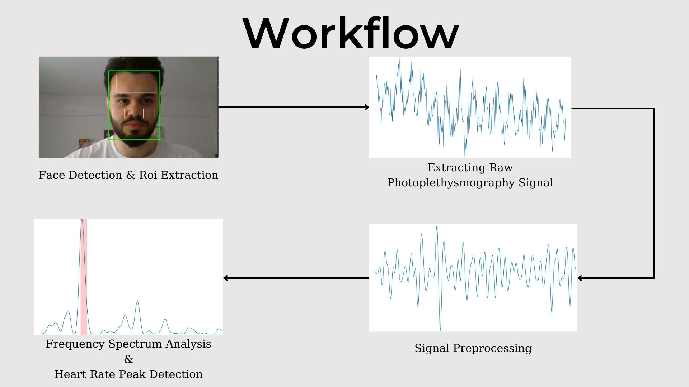

# Non-contact-Heart-Rate-Estimation

**Contributors**


>Semih Demir sdemir1414@gmail.com

>Serkan Can Caglayan serkan.can.caglayan99@gmail.com 

>Nurullah Calik nurullah.calik@medeniyet.edu.tr

***This study can be used for educational or research purposes only.***


In this study Non-contact heart rate estimation is performed by analyzing the color change that occurs in the skin during each cardiovascular cycle. This color change that is too small to be seen with the naked eye, was converted into a signal of size (fps * video length) by recording the green channel averages of the 3 regions of the face in each frame in the given video. The frequency spectrum of the signal, which was denoised with the signal preprocessing steps, is analyzed and the pulse is detected.




**Running a Demo**
```
$ git clone https://github.com/serkancancaglayan/Non-contact-Heart-Rate-Estimation.git
$ cd Non-contact-Heart-Rate-Estimation
$ pip install -r requirements.txt
$ python3 runDemo.py --videoSource <Video path or camera index>, --duration <Length of video clip for heart rate detection(15 is recommended), --plot <1 or 0>
```

***Benchmarking***

This study tested on dataset named ***LGI-PPGI-Face-Video-Database***.

>The dataset can be accessed from link : https://github.com/partofthestars/LGI-PPGI-DB
<br>
<p align="center"></p>
<p align="center"></p>
<p align="center"></p>
<br>

The videos in the dataset is divided into 15-second clips and the heart rate corresponding to each clip is tabulated.
Output of our algorithm for each clip compared with ground truth. Clips with a relative error less than 5% were labeled as 1, clips with a larger error were labeled as 0. The sum of the accuracy column is divided by the column length and the accuracy value is calculated as ***%78.4***.

<p align="center"></p>
***This project was developed as undergraduate final project within ISAR Lab***

https://github.com/ISAR-Lab
